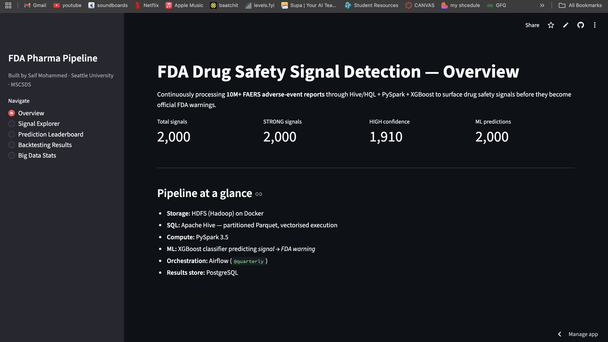
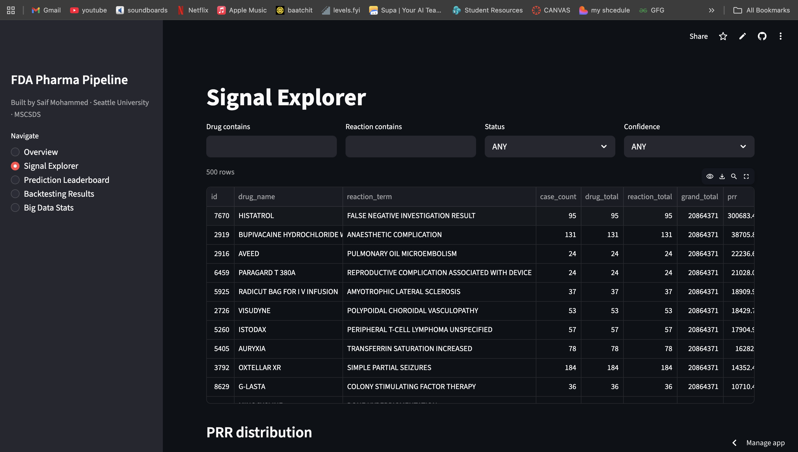
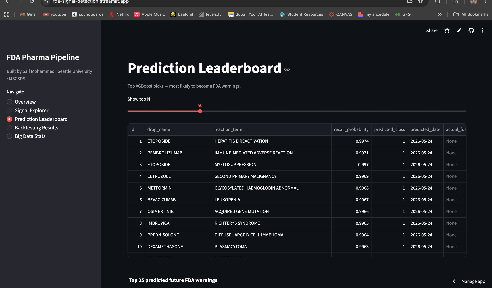
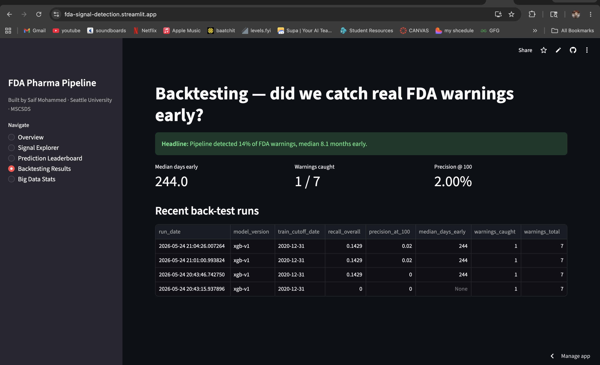
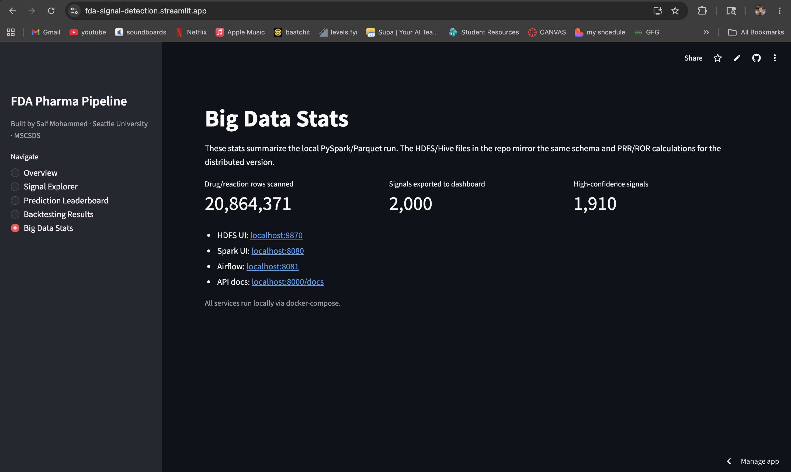
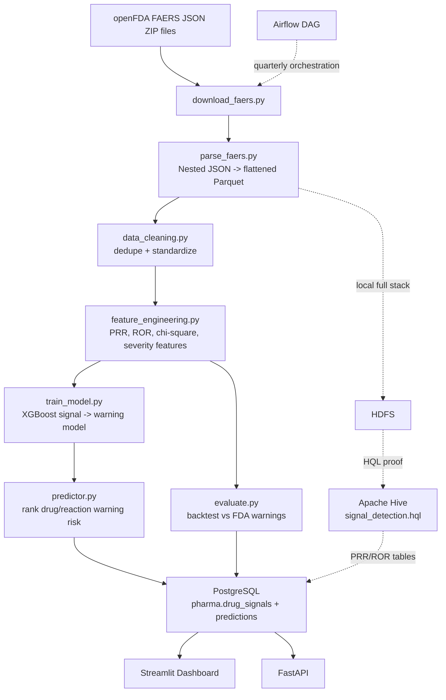

# FDA Drug Safety Signal Detection at Scale

[](https://fda-signal-detection.streamlit.app/)
[](https://www.python.org/)
[](https://spark.apache.org/)
[](https://www.postgresql.org/)

A zero-cost pharmacovigilance pipeline that processes public FDA FAERS
adverse-event data, computes PRR/ROR disproportionality signals, ranks
drug-reaction pairs with XGBoost, and visualizes early-warning candidates in a
Streamlit dashboard.

The project mirrors the kind of signal detection workflow used in drug safety
monitoring: ingest raw FAERS reports, flatten drug/reaction combinations,
calculate statistical disproportionality, train a warning-risk model, and
back-test detected signals against historical FDA warnings.

**Live demo:** [fda-signal-detection.streamlit.app](https://fda-signal-detection.streamlit.app/)

**Current backtest headline:** `Pipeline detected 14% of FDA warnings, median 8.1 months early.`

---

## Dashboard Snapshots

### Overview



### Signal Explorer



### Prediction Leaderboard



### Backtesting Results



### Big Data Stats / Deployment Mode



---

## Why This Project Matters

The FDA receives millions of adverse-event reports through FAERS. Safety teams
use statistical signal detection to identify drug-reaction combinations that
appear more frequently than expected. Those signals are investigated and may
eventually become safety communications, label changes, boxed warnings, or
recalls.

This project recreates that workflow locally:

- Uses **real public FAERS data**, not synthetic data.
- Implements **PRR** and **ROR** disproportionality analysis.
- Uses **PySpark** for large nested JSON ingestion, cleaning, and feature
  engineering.
- Keeps **Hive/HQL** implementations in the repo as distributed SQL proof.
- Trains **XGBoost** to rank which safety signals are likely to become FDA
  warnings.
- Stores results in **PostgreSQL** and serves them through **Streamlit**.
- Runs locally for **$0** with Docker Compose and no paid cloud services.

---

## Architecture



### Stack

| Layer | Technology |
| --- | --- |
| Data source | FDA FAERS / openFDA public adverse-event files |
| Local storage | Parquet under `data/processed/` |
| Distributed storage design | HDFS via Docker Compose |
| Big data SQL | Apache Hive + HQL |
| Distributed compute | Apache Spark / PySpark |
| ML | XGBoost + scikit-learn |
| Results database | PostgreSQL |
| Orchestration | Airflow DAG |
| API | FastAPI |
| Dashboard | Streamlit + Plotly |
| Deployment | Streamlit Cloud snapshot demo |

---

## Cloud Demo vs Local Full Stack

The public Streamlit app is a **portfolio demo**. Streamlit Cloud cannot expose
my local Docker network, HDFS NameNode, Spark UI, Airflow UI, FastAPI server, or
PostgreSQL container. For that reason, the deployed dashboard reads exported
CSV snapshots from:

```text
dashboard/data/signals.csv
dashboard/data/predictions.csv
dashboard/data/backtests.csv
```

On my Mac, the full pipeline runs locally with Docker/PySpark/PostgreSQL and can
regenerate those dashboard snapshots from real FAERS data.

---

## Core Signal Detection Math

For every `drug_name` x `reaction_term` pair, the pipeline computes:

```text
PRR = (drug_reaction_count / drug_total) / (reaction_total / grand_total)

ROR = (drug_reaction_count * (grand_total - reaction_total))
      / ((drug_total - drug_reaction_count) * reaction_total)
```

Signal thresholds:

```text
PRR > 2.0 and case_count >= 3  -> signal
ROR > 2.0 and case_count >= 3  -> confirmed signal
PRR and ROR both high          -> high-confidence signal
```

The same PRR/ROR logic is represented in both:

- `hive/signal_detection.hql`
- `spark/feature_engineering.py`

---

## Current Results

From the local 2020-cutoff backtest:

| Metric | Value |
| --- | ---: |
| Future FDA warnings evaluated | 7 |
| Warnings caught | 1 |
| Recall | 14.3% |
| Median lead time | 244 days |
| Median months early | 8.1 months |
| Precision @ 100 | 2.0% |

Generated report:

```text
data/processed/backtest_report.json
```

Headline:

```text
Pipeline detected 14% of FDA warnings, median 8.1 months early.
```

---

## Repository Layout

```text
fda-signal-detection/
├── streamlit_app.py              # Streamlit Cloud entrypoint
├── docker-compose.yml            # HDFS, Hive, Spark, Postgres, Airflow, API, dashboard
├── Makefile                      # local workflow shortcuts
├── requirements.txt              # Streamlit Cloud dependencies
├── requirements_local.txt        # local development dependencies
├── ingestion/
│   ├── download_faers.py         # download FAERS files from openFDA
│   ├── parse_faers.py            # nested JSON -> Parquet
│   └── load_to_hdfs.py           # push local Parquet to HDFS
├── hive/
│   ├── create_tables.hql
│   ├── partitioned_tables.hql
│   ├── signal_detection.hql      # PRR/ROR Hive implementation
│   └── signal_trends.hql
├── spark/
│   ├── data_cleaning.py
│   ├── feature_engineering.py    # PRR/ROR + ML features in PySpark
│   └── batch_processing.py
├── ml/
│   ├── train_model.py
│   ├── predictor.py
│   ├── evaluate.py
│   └── load_dashboard_data.py
├── pipeline/
│   └── airflow_dag.py
├── api/
│   ├── main.py
│   └── report.py
├── dashboard/
│   ├── app.py
│   ├── export_data.py
│   └── data/                     # deployed dashboard snapshots
├── sql/
│   └── init.sql                  # PostgreSQL schema
├── data/
│   └── reference/
│       ├── fda_warnings.csv
│       └── drug_recalls.csv
└── docs/images/                  # README screenshots
```

---

## Run the Streamlit Demo Locally

```bash
git clone https://github.com/Mohammed-Saif-07/FDA-SIGNAL-DETECTION.git
cd FDA-SIGNAL-DETECTION
pip install -r requirements.txt
streamlit run streamlit_app.py
```

This runs the same snapshot mode used by Streamlit Cloud.

---

## Run the Local PySpark Backtest

Recommended local setup uses a conda environment with Python 3.11:

```bash
conda create -n fda python=3.11 -y
conda activate fda
pip install -r requirements_local.txt
```

Run a constrained 2020 backtest sample:

```bash
make local-backtest-2020-wide LIMIT=20 BACKTEST_CUTOFF=2020-12-31
```

Or run the final stages if cleaned Parquet already exists:

```bash
make local-finish-2020
```

Export dashboard tables to PostgreSQL:

```bash
python ml/load_dashboard_data.py --signals-top-n 10000 --predictions-top-n 10000
```

Start the dashboard locally:

```bash
streamlit run dashboard/app.py
```

---

## Run Docker Services Locally

The full Docker Compose stack is included for local demonstration of the
distributed architecture:

```bash
docker compose up -d postgres
```

For the full stack:

```bash
docker compose up -d
```

Local service URLs:

| Service | URL |
| --- | --- |
| Streamlit | http://localhost:8501 |
| FastAPI docs | http://localhost:8000/docs |
| PostgreSQL | `localhost:5432` |
| HDFS NameNode UI | http://localhost:9870 |
| Spark UI | http://localhost:8080 |
| Airflow | http://localhost:8081 |
| HiveServer2 | `localhost:10000` |

These links are local-only and will not work from the public Streamlit Cloud
deployment.

---

## Notes on Data Size

FAERS is large and updated quarterly. The repo does not commit raw FAERS ZIPs or
large generated Parquet directories. The deployed dashboard uses compact
snapshot CSV files, while the local pipeline can regenerate them from downloaded
FAERS data.

The current dashboard snapshot summarizes:

- `20,864,371` scanned drug/reaction rows
- `2,000` exported signal rows
- `2,000` exported prediction rows
- `4` recent backtest records

---

## Resume Pitch

> Built a local big-data pharmacovigilance pipeline that processes FDA FAERS
> adverse-event reports, implements PRR/ROR disproportionality analysis in
> Hive/HQL and PySpark, trains an XGBoost model to rank warning risk, stores
> outputs in PostgreSQL, and deploys an interactive Streamlit dashboard showing
> drug safety signals and backtest performance.

---

## Author

**Saif Mohammed**  
MSCSDS, Seattle University  
GitHub: [Mohammed-Saif-07](https://github.com/Mohammed-Saif-07)

