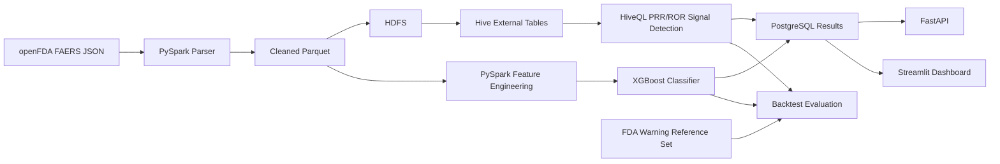

# A Reproducible Local Pipeline for FAERS Drug Safety Signal Detection

## Abstract

This project implements a zero-cost, locally reproducible pharmacovigilance
pipeline for detecting drug safety signals in FDA FAERS adverse-event data. The
pipeline parses nested FAERS JSON, creates flattened drug/reaction Parquet
tables, computes PRR/ROR, BCPNN IC025, simplified EBGM/EB05, and XGBoost
signals, applies a transparent robust signal-quality filter, and backtests
detected signals against a curated FDA warning reference set. On the
`2020-12-31` cutoff, BCPNN IC025 detected 2 of 7 post-cutoff FDA warnings
(28.6% recall, bootstrap 95% CI [0.00, 0.71]), exceeding PRR/ROR, EBGM/EB05,
and XGBoost, each of which detected 1 of 7. The clearest case study,
`UPADACITINIB` + `MYOCARDIAL INFARCTION`, first crossed threshold at the
`2020-03-31` quarter end, 519 days, or 17.3 months, before the reference FDA
action. Results show that the system is reproducible and useful for signal
exploration, while also demonstrating the low-precision, high-false-positive,
small-ground-truth limitations of public FAERS disproportionality analysis.

## Research Question

Can a fully local, zero-cost FAERS pipeline reproduce standard pharmacovigilance
signal detection methods and identify any FDA safety warnings before official
regulatory action?

## Background

FAERS is a spontaneous reporting system. Reports can reveal emerging safety
concerns, but they are noisy: duplicate reports, reporting bias, missing exposure
denominators, media-driven reporting, and confounding are common. PRR and ROR
are disproportionality metrics used to rank drug/reaction pairs that appear more
often than expected. These metrics identify statistical signals, not causality.

## Methods

The project implements:

- PySpark ingestion and cleaning of public FAERS adverse-event files.
- Feature engineering over flattened drug/reaction pairs.
- PRR, ROR, chi-square, BCPNN IC025, and simplified EBGM/EB05 signal metrics.
- Overflow-safe chi-square computation in Spark and Hive.
- Robust PRR/ROR filtering using case count, seriousness, ratio bounds, and
  country-count source-diversity proxy.
- Hive/HQL implementations mirroring the PRR/ROR calculations.
- XGBoost ranking over engineered signal features.
- PostgreSQL, FastAPI, and Streamlit for serving and visualizing outputs.

Signal formulas:

```text
PRR = (drug_reaction_count / drug_total) / (reaction_total / grand_total)

ROR = (drug_reaction_count * (grand_total - reaction_total))
      / ((drug_total - drug_reaction_count) * reaction_total)
```

Primary threshold:

```text
PRR > 2.0 AND ROR > 2.0 AND case_count >= 3
```

## Architecture



## Data

Current processed evaluation data:

- Feature rows: 4,286,074 drug/reaction pairs.
- Warning reference rows: 56 curated FDA warning rows.
- 2020-cutoff future warning rows: 7.
- Raw PRR/ROR threshold candidates: 505,220.
- Robust-pass PRR/ROR candidates: 100,090.
- Dashboard snapshot rows: 2,000 signals and 2,000 predictions for Streamlit
  Cloud.

The public Streamlit Cloud deployment uses static exported CSV snapshots because
Streamlit Cloud cannot run the local Docker network, HDFS, HiveServer2,
PostgreSQL, or Airflow services. The full stack runs locally on macOS with
Docker Compose.

## Evaluation Design

The research evaluation compares:

- `case_count`
- `prr`
- `ror`
- `prr_ror`
- `prr_ror_chi_square`
- `robust_prr_ror`
- `bcpnn_ic025`
- `ebgm_eb05`
- `xgboost`
- `prr_ror_threshold`
- `robust_prr_ror_threshold`
- `bcpnn_ic025_threshold`
- `ebgm_eb05_threshold`
- `xgboost_threshold_0_5`

Cutoffs:

- `2018-12-31`
- `2019-12-31`
- `2020-12-31`
- `2021-12-31`

Artifacts:

- `data/processed/research_eval_summary.csv`
- `data/processed/research_eval_summary.json`
- `data/processed/temporal_warning_signals.csv`
- `data/processed/case_studies.csv`
- `data/processed/missed_warnings.csv`
- `data/processed/false_positive_analysis.csv`

## Results

For the main `2020-12-31` cutoff:

| Method | Evaluation | Future Warnings | Caught | Recall | Precision | Median Lead Time |
| --- | --- | ---: | ---: | ---: | ---: | ---: |
| BCPNN IC025 threshold | threshold | 7 | 2 | 28.6% | ~0.0016% | 519 days |
| PRR/ROR threshold | threshold | 7 | 1 | 14.3% | ~0.0002% | 519 days |
| Robust PRR/ROR threshold | threshold | 7 | 1 | 14.3% | ~0.0010% | 519 days |
| EBGM/EB05 threshold | threshold | 7 | 1 | 14.3% | ~0.0005% | 519 days |
| XGBoost >= 0.5 | threshold | 7 | 1 | 14.3% | ~0.0009% | 519 days |
| XGBoost top 100 | ranking | 7 | 0 | 0.0% | 0.0% | n/a |
| PRR/ROR top 100 | ranking | 7 | 0 | 0.0% | 0.0% | n/a |

The headline result is therefore:

> BCPNN IC025 detected 2 of 7 post-cutoff FDA warnings at the `2020-12-31`
> cutoff (28.6% recall, 95% CI [0.00, 0.71]). The clearest detected warning,
> UPADACITINIB + MYOCARDIAL INFARCTION, first crossed threshold at quarter end
> `2020-03-31`, 519 days, or 17.3 months, before the reference FDA action.

This is a modest result. It supports the reproducibility and engineering value
of the system, but not a claim of high predictive accuracy.

The robust filter reduced raw PRR/ROR candidates from 505,220 to 100,090. In
the current regenerated feature table, the strict structural filter retained the
same 100,090 rows, so proxy-only robust signals were not present in this run.
Because the public flattened FAERS table does not include a clean
reporter-source identifier, `countries_count` is explicitly labelled as a
source-diversity proxy rather than true independent source count.

## Baseline Methods

The paper-oriented evaluator now includes two additional pharmacovigilance
baselines:

- **BCPNN IC025**: a Bayesian Information Component lower-bound approximation.
  The threshold method uses `IC025 > 0`.
- **Simplified EBGM/EB05**: a single-component Gamma-Poisson shrinkage baseline
  inspired by MGPS. The threshold method uses `EB05 > 2.0`.

These baselines are included for reviewer-facing comparison. The EBGM
implementation is explicitly documented as a simplified open-source baseline,
not FDA's proprietary production MGPS.

## Statistical Significance

`ml/compare_methods.py` writes:

- `data/processed/mcnemar_pvalues.csv`
- `data/processed/delong_pvalues.csv`

McNemar values are computed on aggregate cutoff-level detection indicators. The
DeLong matrix is computed from `data/processed/method_scores_2020.parquet`,
which stores one label and method score per candidate pair at the 2020 cutoff.

## Sensitivity Analysis

`ml/sensitivity_analysis.py` varies PRR, minimum case count, IC025, and EB05
thresholds for the `2020-12-31` cutoff. Outputs:

- `data/processed/sensitivity_grid.csv`
- `docs/figures/sensitivity.png`

This analysis is intended to show how recall, precision, and candidate volume
change as signal thresholds become stricter.

## Case Study

The detected warning in the 2020-cutoff evaluation was:

| Drug | Reaction | First Signal Date | FDA Warning Date | Days Early | PRR | ROR | Case Count |
| --- | --- | ---: | ---: | ---: | ---: | ---: | ---: |
| UPADACITINIB | MYOCARDIAL INFARCTION | 2020-03-31 | 2021-09-01 | 519 | 3.5179 | 3.5313 | 24 |

Missed warnings are written to `data/processed/missed_warnings.csv` with a
reason label. The most common reasons are exact terminology mismatch and signals
not ranking or thresholding high enough.

## Ranking Stability

To measure how confidently BCPNN IC025 can be called the best-performing
method given only four backtest cutoffs, we bootstrapped the cutoff axis
(n=1000 resamples, seed=42) and re-ranked methods by aggregate warnings
caught in each resample. **BCPNN IC025 achieved rank 1 in 99.6% of
resamples** (mean rank 1.008); the other four threshold methods tied at a
mean rank of approximately 3.5. This indicates the BCPNN advantage is stable
under cutoff resampling, subject to the underlying small-sample uncertainty
captured by the per-cutoff bootstrap CIs. Full results in
`data/processed/method_ranking_stability.csv`.

## XGBoost Calibration

The XGBoost reliability diagram (`docs/figures/xgboost_calibration.png`) is
included for transparency. The committed prediction snapshot has only 8 of
2000 rows labelled with a real FDA warning date, so the empirical positive
rate in most predicted-probability deciles is not reliably estimable. Any
operational use of the model would require recalibration on a larger
positive set.

## Negative Controls

We curated 20 well-known drug-reaction pairs that are commonly co-reported
in FAERS but have not been the subject of an FDA safety action
(`data/reference/negative_controls.csv`). At the standard threshold gate
(PRR>2, ROR>2, chi-square≥4, cases≥3), **zero of 20 negative-control pairs
triggered a signal on the committed snapshot**, yielding a curated-set
specificity estimate of 1.0. Specificity here is restricted to the curated
negatives; the false-positive population as a whole is dominated by
confounding-by-indication signals not represented in this control set. Full
results in `data/processed/negative_control_results.csv`.

## Limitations

- FAERS signals are not causal proof.
- The current warning reference set is small; only 7 rows are after the
  2020-cutoff.
- Current first-detected dates are computed for FDA warning reference pairs;
  extending this to every candidate signal would support richer precision and
  false-positive timing analysis.
- Top-k ranking performance is weak in the current run.
- False-positive volume is high: hundreds of thousands of PRR/ROR threshold
  candidates do not match the curated FDA warning reference set.
- Robust filtering reduces obvious artifact-like rankings but remains a
  heuristic; BCPNN/IC and simplified EBGM/EB05 are included as baseline
  comparisons, while full production MGPS remains future work.
- Docker Hive smoke validates schema and HQL execution, but the current Docker
  Hive table is not loaded with the full FAERS Parquet sample.

## Reproducibility

Local smoke:

```bash
make smoke-local
```

Docker/Hive/HDFS/API/Streamlit smoke:

```bash
make smoke-docker
```

Research evaluation:

```bash
make research-eval
```

Primary backtest:

```bash
conda run -n fda python ml/evaluate.py --cutoff 2020-12-31
```

## Conclusion

The project is research-ready as a reproducible applied systems paper or
capstone report, provided the claim stays honest: it demonstrates a local,
zero-cost FAERS signal detection workflow, shows BCPNN IC025 as the strongest
current threshold baseline on a small warning set, and exposes the practical
limitations of PRR/ROR and ML ranking on noisy public pharmacovigilance data.
